>Complete dev configuration aim for a simple, minimalistic look with no distractions and keybindings optimized for usability and efficiency.

### Install terminal:
```
01  homebrew
02  nvim
03  zsh4
04  p10k
05  tmux
06  vifm
07  lazygit
08  fzf
09  ripgrep
10  bat
11  zoxide 
12  eza 
13  trash-cli 
14  empty-trash-cli
```

### Vscode extensions:
```
01  apc customize ui
02  error lens
03  gruvdark theme
04  vim
05  wsl
06  code spell checker
07  eslint
08  find then jump 2
09  find it Faster
10  live preview
11  markdown preview github
12  prettier code
13  vscode harpoon
```

### Preview config:

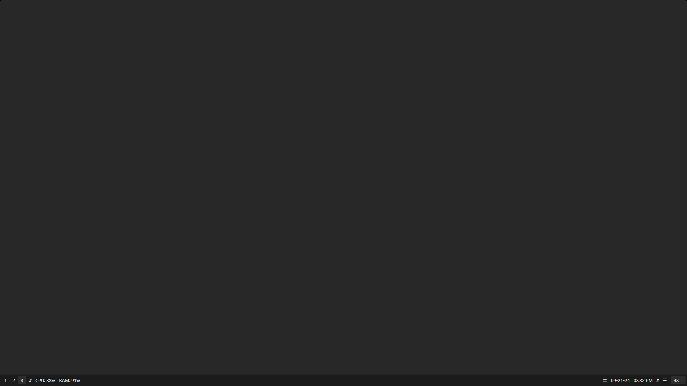  
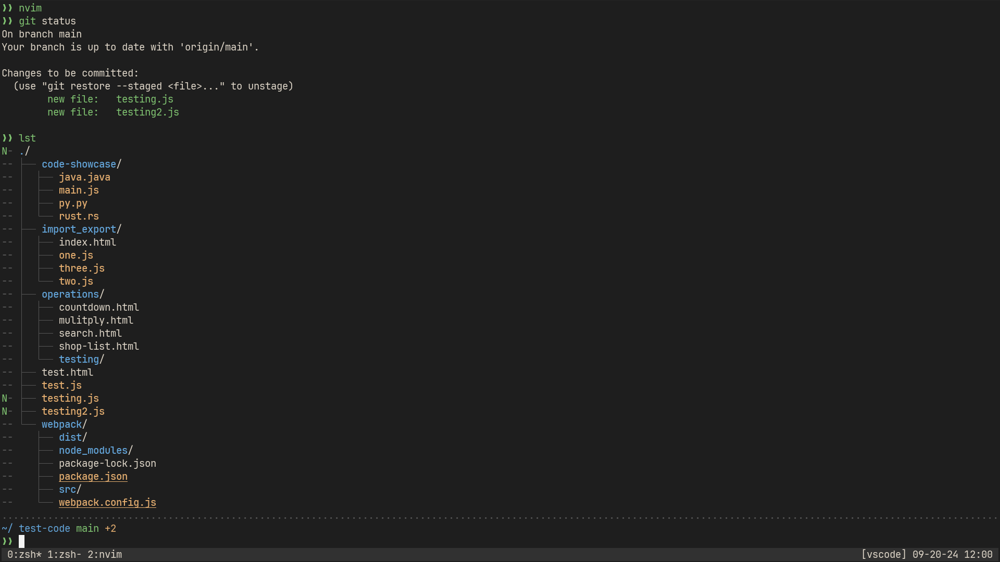

##
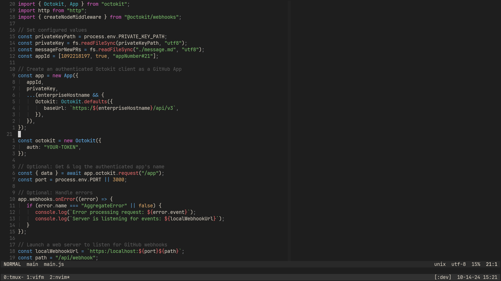
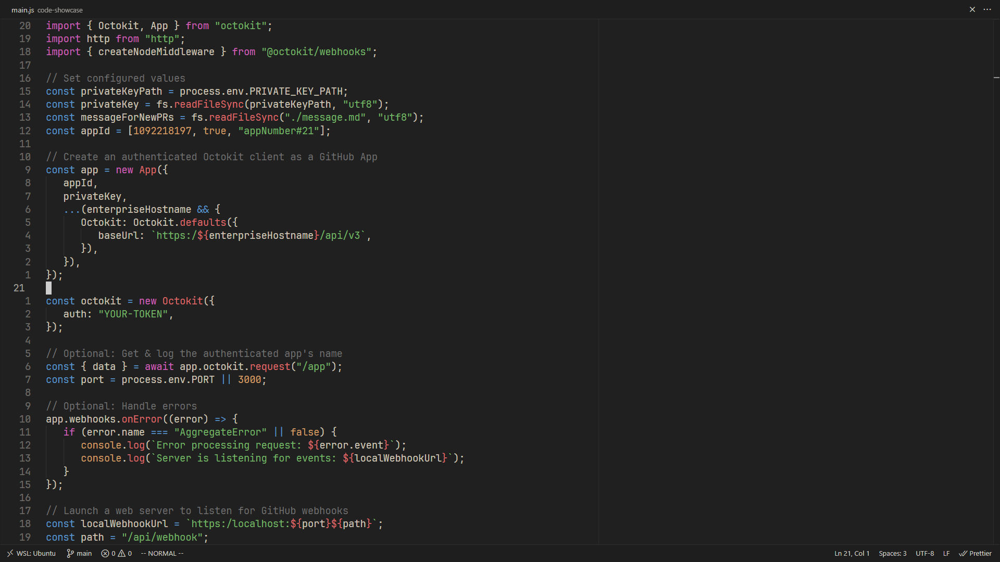

##
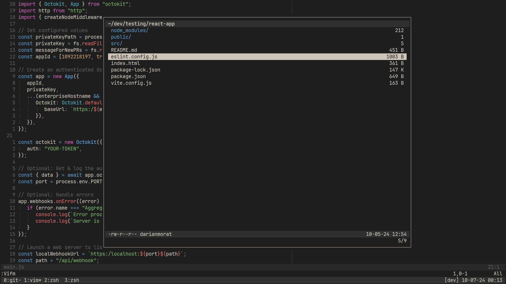
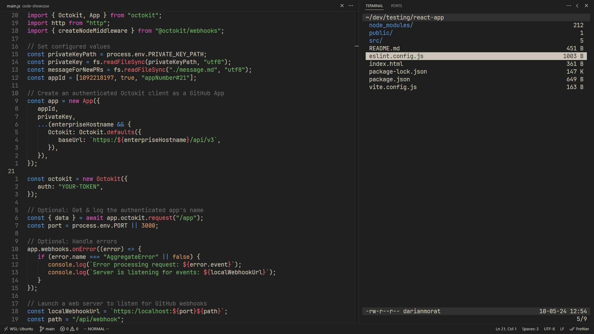

##
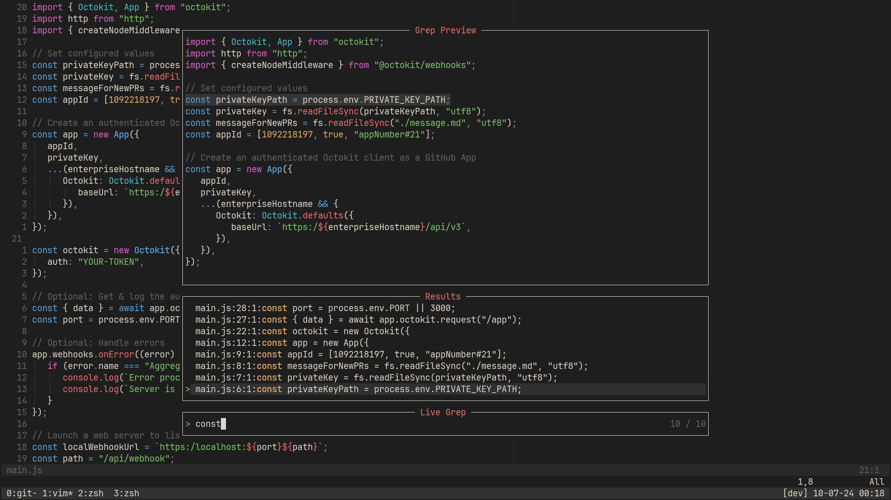
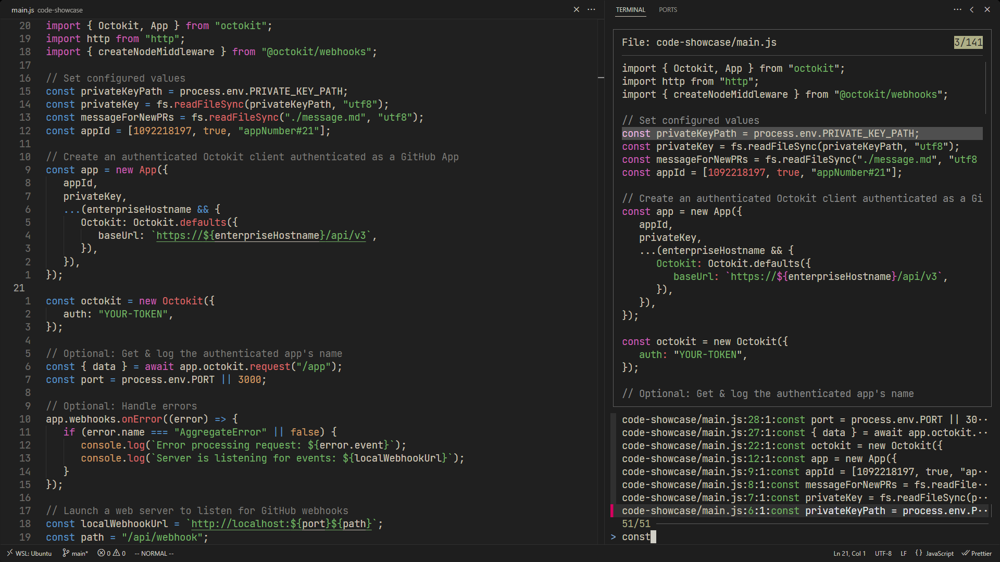

##
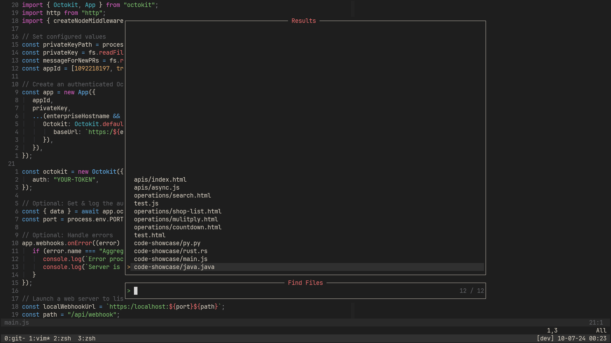
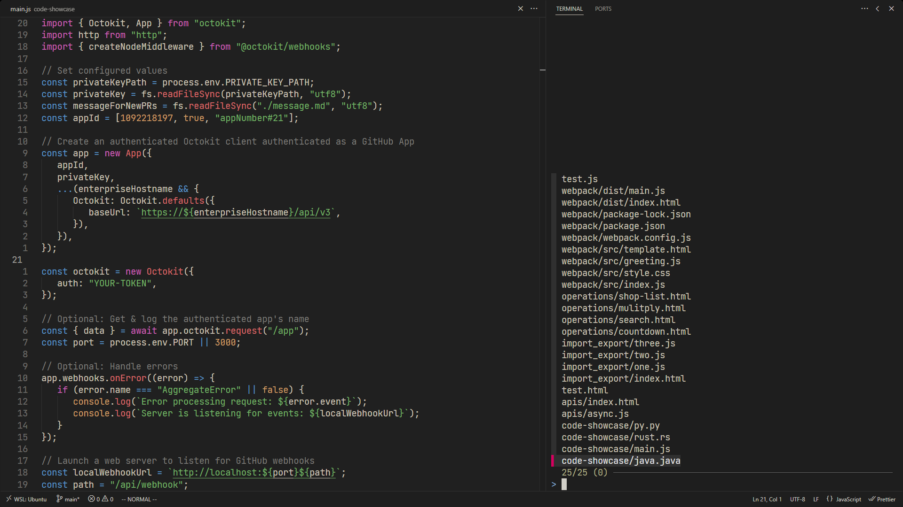

##
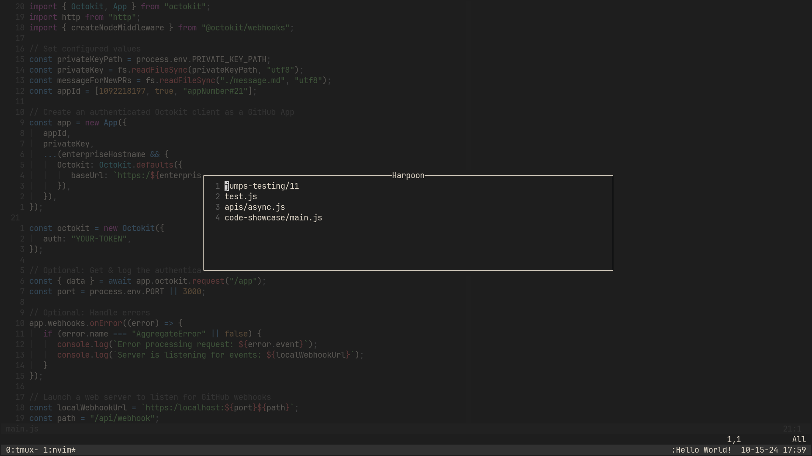