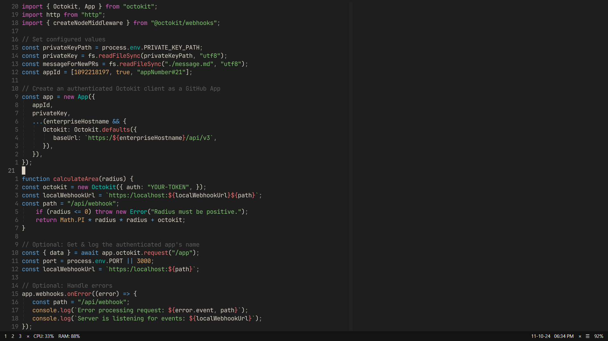

---
### AutoHotKey Setup:
- [autohotkey](https://github.com/AutoHotkey/AutoHotkey) - custom bindings (v1.1)

---
### GlazeWM setup:
- [glazewm](https://github.com/glzr-io/glazewm) - tiling window manager (v3.3.0)
- [zebar](https://github.com/glzr-io/zebar) - custom taskbar (v2.2.2)

---
### Terminal Setup: 
- [wezterm](https://github.com/wez/wezterm) - terminal emulator (nightly)
- [homebrew](https://github.com/Homebrew/brew) - package manager
- Shell ➜
   - [zsh4humans](https://github.com/romkatv/zsh4humans) - zsh prompt
   - [powerlevel10k](https://github.com/romkatv/powerlevel10k) - custom prompt
- Utils ➜
   - [fzf](https://github.com/junegunn/fzf) - fuzzy finder
   - [ripgrep](https://github.com/BurntSushi/ripgrep) - recursive search 
   - [bat](https://github.com/sharkdp/bat) - syntax highlighting
   - [zoxide](https://github.com/ajeetdsouza/zoxide) - better dir navigation
   - [eza](https://github.com/eza-community/eza) - ls replacement
   - [trash-cli](https://github.com/sindresorhus/trash-cli) - trash management
   - [empty-trash-cli](https://github.com/sindresorhus/empty-trash-cli) - empties trash
- Tools ➜
   - [neovim](https://github.com/neovim/neovim) - text editor (v0.11.0)
   - [vifm](https://github.com/vifm/vifm) - vim-like file manager
   - [lazygit](https://github.com/jesseduffield/lazygit) - git management

---
### VSCode Setup: 
- [VSCode](https://github.com/microsoft/vscode) - code editor (v1.91.1)
- Extensions ➜
   - [apc customize ui](https://github.com/drcika/apc-extension) - ui customization
   - [error lens](https://github.com/usernamehw/vscode-error-lens) - errors highlight
   - [gruvdark theme](https://github.com/darianmorat/gruvdark-theme) - color scheme
   - [vim](https://github.com/VSCodeVim/Vim) - vim-like modal editing
   - [wsl](https://github.com/Microsoft/vscode-remote-release) - remote dev
   - [code spell checker](https://github.com/streetsidesoftware/vscode-spell-checker) - spell check
   - [eslint](https://github.com/Microsoft/vscode-eslint) - js linting integration
   - [find then jump 2](https://github.com/darianmorat/find-then-jump-2) - file navigation
   - [find it Faster](https://github.com/tomrijndorp/vscode-finditfaster) - fuzzy finder
   - [live preview](https://github.com/microsoft/vscode-livepreview) - in editor preview
   - [markdown preview github](https://github.com/mjbvz/vscode-github-markdown-preview-style) - github style preview
   - [prettier code](https://github.com/prettier/prettier-vscode) - code formatting
   - [vscode harpoon](https://github.com/tobias-z/vscode-harpoon) - navigation management
