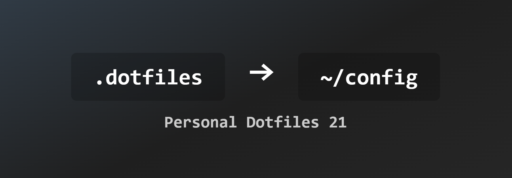

## AutoHotKey Setup:
- [autohotkey](https://github.com/AutoHotkey/AutoHotkey) - custom bindings (v1.1)

## GlazeWM setup:
- [glazewm](https://github.com/glzr-io/glazewm) - tiling window manager (v3.8.1)
- [zebar](https://github.com/glzr-io/zebar) - custom taskbar (v2.7.0)

## Terminal Setup: 
- [wezterm](https://github.com/wez/wezterm) - terminal emulator (nightly)
- [homebrew](https://github.com/Homebrew/brew) - package manager
- Shell ➜
   - [zsh4humans](https://github.com/romkatv/zsh4humans) - zsh prompt
   - [powerlevel10k](https://github.com/romkatv/powerlevel10k) - custom prompt
- Utils ➜
   - [fzf](https://github.com/junegunn/fzf) - fuzzy finder
   - [ripgrep](https://github.com/BurntSushi/ripgrep) - recursive search 
   - [bat](https://github.com/sharkdp/bat) - syntax highlighting
   - [zoxide](https://github.com/ajeetdsouza/zoxide) - better dir navigation
   - [eza](https://github.com/eza-community/eza) - ls replacement
   - [trash-cli](https://github.com/sindresorhus/trash-cli) - trash management
   - [empty-trash-cli](https://github.com/sindresorhus/empty-trash-cli) - empties trash
- Tools ➜
   - [neovim](https://github.com/neovim/neovim) - text editor (v0.11.0)
   - [vifm](https://github.com/vifm/vifm) - vim-like file manager
   - [lazygit](https://github.com/jesseduffield/lazygit) - git management
