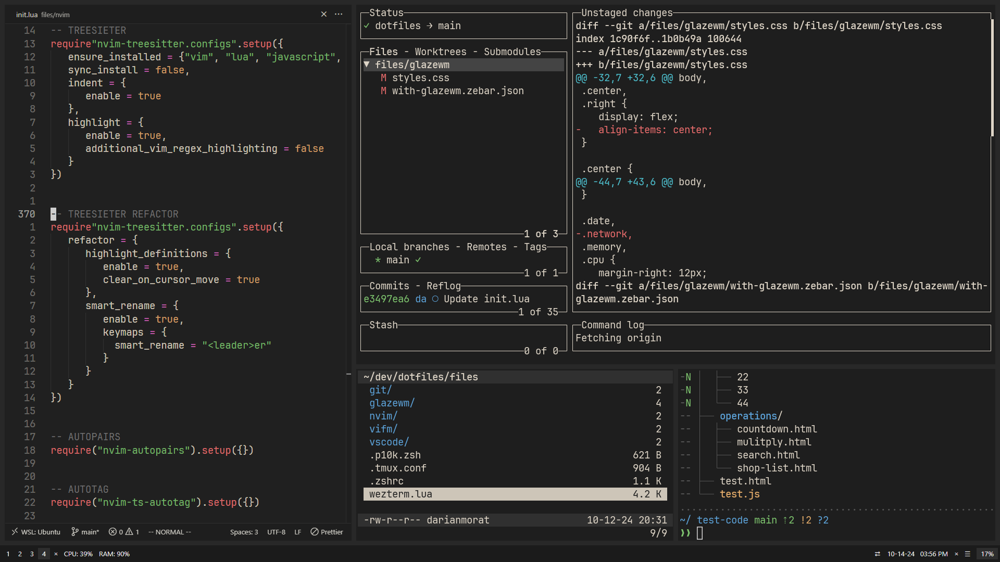
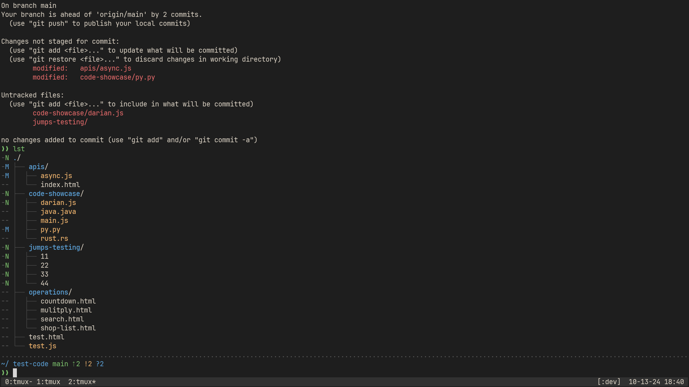

Complete configuration for GlazeWM, WezTerm, VSCode and Neovim... Aim for a simple, minimalistic look with no distractions and keybindings optimized for usability and efficiency.

### GlazeWM - WezTerm:

  

### VSCode - Neovim:

